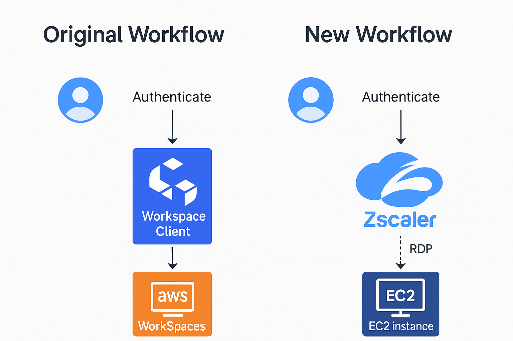

# 🏢 Cloud Cost Optimization: Migrating from AWS Workspaces to EC2 + Zscaler ZPA

This repo documents a real-world cloud optimization project where I led the migration of user environments from AWS Workspaces to a hybrid solution combining Zscaler ZPA (Zero Trust Network Access) with AWS EC2 instances. I skipped over the Zscaler polcies as the purpose of this was to give some ideas on cost savings. 

The project achieved:

✅ ~35% per-user monthly cost reduction  
✅ Improved app performance  
✅ Seamless Zero Trust access without VPN clients  
✅ Enhanced user experience and security

---

## 📈 Background

Our organization was facing rising AWS Workspaces costs with inconsistent performance. I initiated a project to explore alternative solutions that could reduce costs while maintaining secure, reliable access to user environments.

---

## 🏗️ Architecture Overview

---

## 🔄 Migration Process

The project followed these core steps:

1. **Cost Analysis & Assessment** – Identified inefficiencies in Workspaces licensing and resource usage.
2. **Design New Architecture** – Designed a hybrid solution using Zscaler ZPA + EC2.
3. **Security & Access Configuration** – Implemented ZPA policies and configured secure access to EC2.
4. **Provision EC2 Instances** – Deployed optimized EC2 instances tailored to workloads.
5. **User Testing & Transition** – Piloted with key users, phased migration from Workspaces to EC2.
6. **Documentation & Support** – Created guides and documentation for smooth onboarding.

---

## ✅ Outcomes

- **~35% per-user cost reduction**
- **Improved application performance and responsiveness**
- **Full control over EC2 familes, instead of cookie cutter builds**
- **Enhanced security via Zero Trust model**
- **Improved user satisfaction with seamless access**

---

## 💡 Skills & Tools Used

- AWS EC2
- AWS Workspaces
- Zscaler ZPA
- Zero Trust security
- Cloud cost optimization
- Infrastructure design
- Remote access solutions

---

## 📚 Documentation

- [User Guide](docs/user-guide.md)
- [Sample Configurations](docs/sample-config.md)

---

## 🔗 Related Projects

Explore more of my cloud optimization and infrastructure projects:

🔹 [Homelab 2025](https://github.com/sgersz/homelab-2025): A secure, scalable home lab infrastructure combining virtualization, containerization, automation, and Zero Trust networking.

🔹 [Homelab Monitoring](https://github.com/sgersz/observability-dashboard): Monitoring stack using Prometheus, Grafana, node_exporter, and cAdvisor to visualize system and Docker metrics in real time.

🔹 [Workspace Cost Reduction](https://github.com/sgersz/-workspacecostreduction): Cloud cost optimization project migrating from AWS Workspaces to EC2 + Zscaler ZPA, reducing per-user costs by 35%.

🔹 [Simple CI/CD Pipeline](https://github.com/sgersz/simplecicd): Demo repo automating Docker builds for a Flask app using GitHub Actions.

🔹 [Toolbox](https://github.com/sgersz/toolbox): A curated collection of scripts automating cloud infrastructure, security, identity, DevOps, and IT operations across AWS, Azure, GitHub, Zscaler, CrowdStrike, Intune, and more.

## 🚀 **Connect with me**

